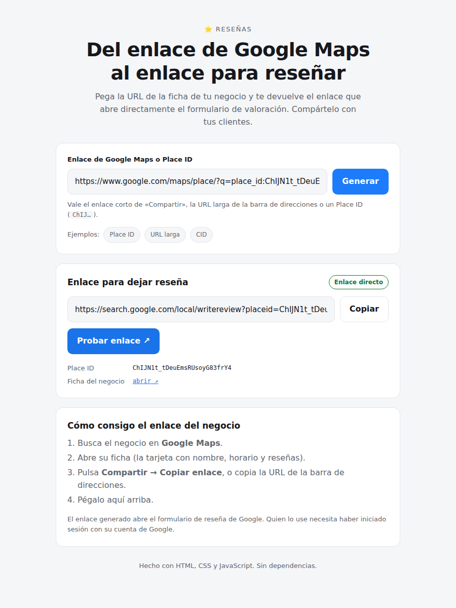

# Generador de enlaces de reseña de Google

Pega el enlace de Google Maps de un negocio y la app devuelve el enlace que
abre directamente el formulario para **dejar una reseña**. Pensado para que un
negocio lo comparta con sus clientes (WhatsApp, email, ticket, QR…).



## Arrancar

```bash
npm start           # http://localhost:3000
npm test            # tests del analizador de enlaces
```

Sin dependencias: sólo Node.js 18 o superior.

## Qué acepta como entrada

| Entrada | Ejemplo | Resultado |
|---|---|---|
| Place ID | `ChIJN1t_tDeuEmsRUsoyG83frY4` | Enlace directo |
| URL con `place_id` | `.../maps/place/?q=place_id:ChIJ…` | Enlace directo |
| URL con `query_place_id` | `.../maps/search/?api=1&query=…&query_place_id=ChIJ…` | Enlace directo |
| URL larga de la ficha | `.../maps/place/Nombre/@40.4,-3.7,17z/data=!…!1s0x…:0x…` | Aproximado (o directo con API key) |
| CID | `https://maps.google.com/?cid=1110917…` | Aproximado |
| Enlace corto | `https://maps.app.goo.gl/abc123` | Se resuelve en el servidor y se trata según su destino |

También funciona si pegas el enlace dentro de un texto: se extrae la primera URL.
Eso cubre el caso del móvil, donde **Compartir** copia el nombre del sitio, la
dirección y el enlace corto juntos; ese nombre se usa como plan B si el enlace
corto no se puede resolver (requiere `GOOGLE_MAPS_API_KEY`).

### Enlaces cortos y móvil

`maps.app.goo.gl` no contiene ningún identificador: hay que seguir su
redirección, y el navegador no puede hacerlo (CORS). Lo hace `/api/resolve`, así
que **el flujo del móvil necesita que las funciones estén desplegadas**. Si no lo
están, la app lo dice explícitamente (`/api/health` responde 404) en vez de dar
un error genérico.

## Los dos niveles de resultado

* **Enlace directo** (`exact`) — se ha obtenido el Place ID, así que se genera
  el enlace canónico de Google:
  `https://search.google.com/local/writereview?placeid=<PLACE_ID>`
  Abre el formulario de reseña sin pasos intermedios.

* **Aproximado** (`partial`) — la URL sólo traía el CID/FTID del negocio
  (el par `0x…:0x…` del parámetro `data`), no el Place ID. Google no publica
  ninguna conversión de CID a Place ID, así que se genera el enlace al panel
  de reseñas de la búsqueda (`#lrd=…,3`), que es lo más cerca que se llega sin
  API. La app lo avisa en pantalla en vez de hacerlo pasar por directo.

Para convertir esos casos en enlace directo, arranca la app con una clave de
la **Places API (New)**:

```bash
GOOGLE_MAPS_API_KEY=tu_clave npm start
```

Con la clave configurada, el servidor busca el negocio por nombre y
coordenadas (`places:searchText`) y recupera su Place ID. La clave se queda en
el servidor, nunca se envía al navegador.

## Cómo está organizado

```
public/parser.js   Lógica pura: URL -> identificadores -> enlaces. La usan
                   tanto el navegador como el servidor (mismo módulo ESM).
public/index.html  Interfaz.
public/app.js      Analiza en el navegador y sólo llama al servidor cuando
                   hace falta (enlaces cortos o búsqueda de Place ID).
lib/resolve.js     Resolución con red: enlaces cortos + Places API.
api/resolve.js     Función serverless (Vercel) sobre lib/resolve.js.
api/health.js      Función serverless de diagnóstico.
server.js          Servidor de desarrollo: sirve public/ y los mismos endpoints.
test/              Tests (node:test), sin acceso a red.
```

El análisis se hace primero en el navegador, así que **la carpeta `public/`
funciona sola en cualquier hosting estático**; lo único que se pierde sin
servidor es resolver enlaces cortos y la búsqueda de Place ID.

### `POST /api/resolve`

```bash
curl -X POST http://localhost:3000/api/resolve \
  -H 'Content-Type: application/json' \
  -d '{"url":"https://maps.app.goo.gl/abc123"}'
```

Devuelve los identificadores encontrados (`placeId`, `cid`, `ftid`, `name`,
`coords`) y los enlaces generados en `links`.

El servidor sólo sigue redirecciones hacia dominios de Google (`google.*`,
`goo.gl`, `g.co`), para que no pueda usarse como proxy abierto.

## Desplegar en Vercel

El repo ya trae la configuración (`vercel.json`): **web estática** desde
`public/` más **dos funciones serverless** en `api/`.

* Framework Preset: **Other**
* Build Command: *(vacío)*
* Output Directory: **public**
* Variable de entorno opcional: `GOOGLE_MAPS_API_KEY`

Importante: `server.js` es sólo para desarrollo local. Vercel no ejecuta un
servidor con `listen()`; si se intenta desplegar como función, la respuesta es
un `500 FUNCTION_INVOCATION_FAILED`. La versión desplegada usa `api/resolve.js`,
que exporta un handler y comparte la lógica con el servidor local vía
`lib/resolve.js`.

Para comprobar un despliegue de punta a punta:

```bash
npm run check -- https://TU-DESPLIEGUE.vercel.app
```

```
✓ Web estática — index.html servido
✓ API /api/health — runtime v22.x, Places API sin clave
✓ API /api/resolve — https://search.google.com/local/writereview?placeid=ChIJ…
```

Si `/api/health` da 404, las funciones no están desplegadas: la web se sirve,
pero los enlaces cortos no se podrán resolver.

Si sólo quieres la web sin funciones, sube `public/` a cualquier hosting
estático: lo único que se pierde es resolver enlaces cortos.

## Notas

* Quien abra el enlace necesita estar identificado con su cuenta de Google
  para publicar la reseña.
* Google puede cambiar los formatos de URL; los tests de `test/parser.test.js`
  documentan los que se soportan hoy.
